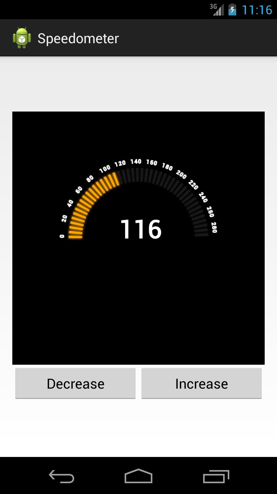

Android-Speedometer
===================

Android custom view that displays a simple Speedometer.



The setup of the custom view should be as simple as placing this snippet in your xml layout:

```xml
<RelativeLayout xmlns:android="http://schemas.android.com/apk/res/android"
    xmlns:tools="http://schemas.android.com/tools"
    xmlns:custom="http://schemas.android.com/apk/res/com.luminiasoft.labs.views"
    android:layout_width="match_parent"
    android:layout_height="match_parent">
    <com.luminiasoft.labs.views.Speedometer
        android:id="@+id/Speedometer"
        android:layout_width="wrap_content"
        android:layout_height="wrap_content"
        custom:currentSpeed="100"
        custom:maxSpeed="300" />
</RelativeLayout>
``` 

Of course, don't forget to include the `/values/attrs.xml` file in your project for this to work.

Developed by
============
Nelson R. Perez - <bilthon@gmail.com>
